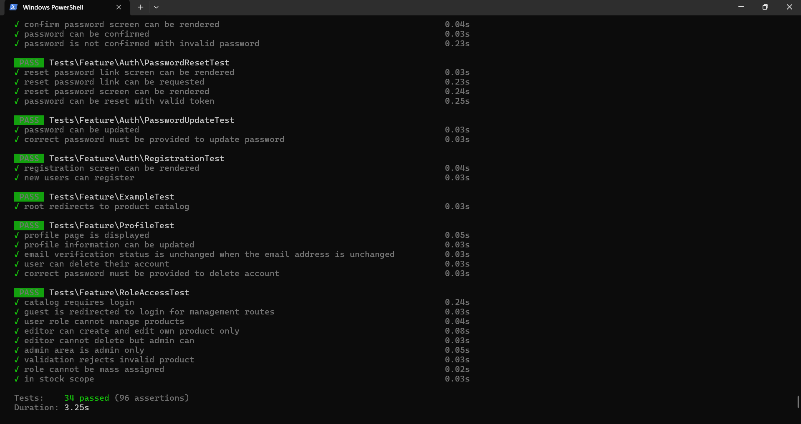
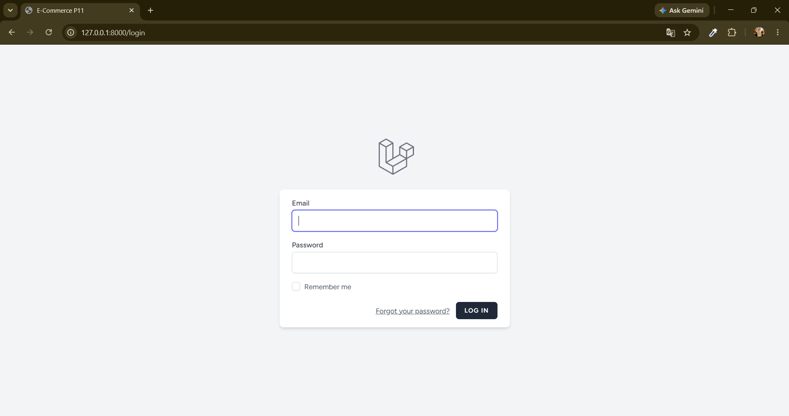
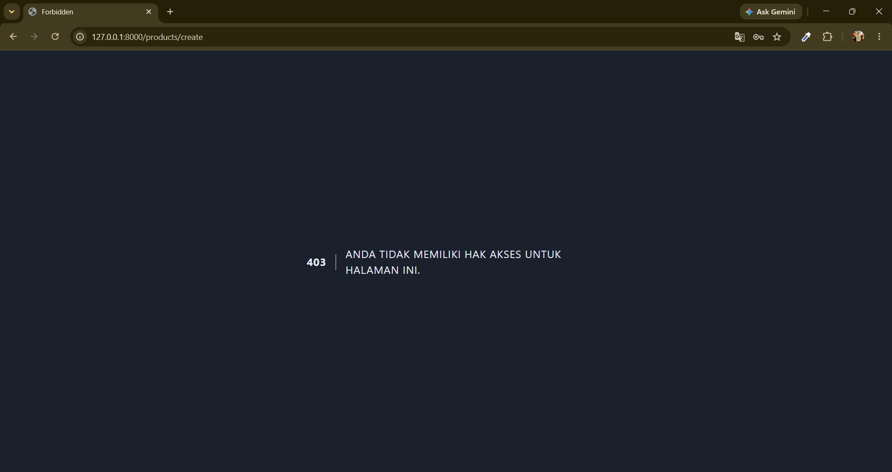
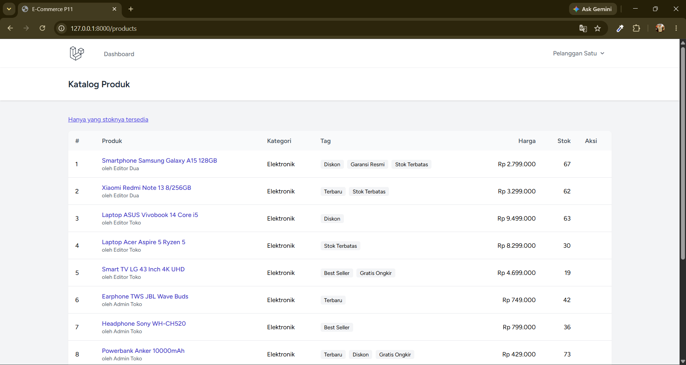
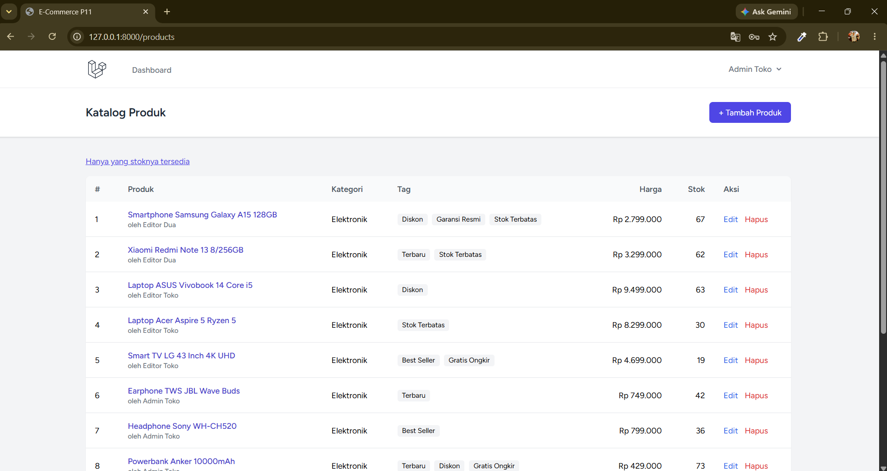
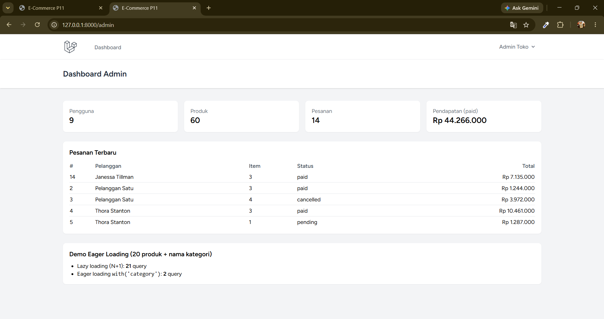
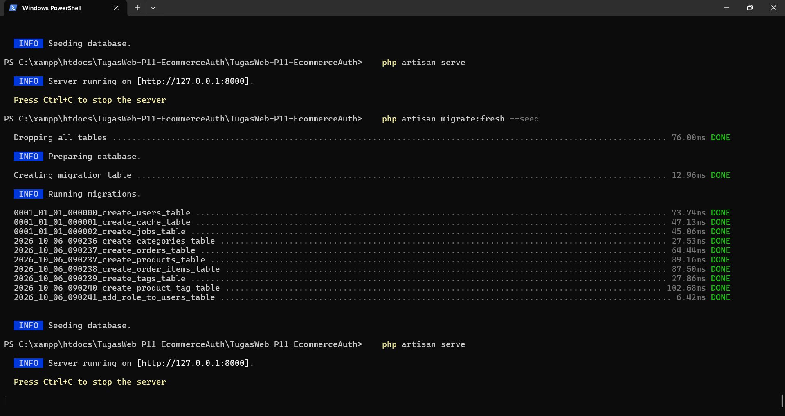

# TugasWeb-P11-EcommerceAuth

**Tugas Rutin 11 — E-Commerce Database & Secure Auth (Laravel 12)**

## 👤 Biodata

| | |
|---|---|
| **Nama** | Felipe Maranatha Lumbanraja |
| **NIM** | 4253250014 |
| **Kelas** | PSIK 25C |
| **Mata Kuliah** | Pemrograman Web |
| **Dosen Pengampu** | Adidtya Perdana, S.T., M.Kom |

---

## 📌 Deskripsi

Aplikasi e-commerce sederhana berbasis Laravel 12 yang mencakup dua bagian tugas:

- **Bagian A — Database & Eloquent:** 7 tabel dengan foreign key, seeder 60 produk realistis, relasi antar model, dan local scope.
- **Bagian B — Auth & Security:** login/register/logout (Laravel Breeze), tiga role (admin, editor, user), middleware kustom, policy otorisasi, dan proteksi route.

**Teknologi:** PHP 8.2+, Laravel 12, MySQL, Laravel Breeze (Blade + Tailwind), PHPUnit.

## ✅ Checklist Requirement

| # | Requirement | Status |
|---|---|:-:|
| 1 | Migrations 7 tabel e-commerce + FK constraints | ✅ |
| 2 | Seeders + factories (50+ produk realistis) — **60 produk** | ✅ |
| 3 | Model + relationships + minimal 1 scope (`inStock`, `inCategory`, `paid`) | ✅ |
| 4 | Dokumentasi 5 query Tinker | ✅ (lihat bagian Tinker) |
| 5 | Install Breeze (login/register/logout) | ✅ |
| 6 | Multi-role (admin/editor/user) + custom middleware (`RoleMiddleware`) | ✅ |
| 7 | Policy otorisasi edit/delete (`ProductPolicy`)* | ✅ |
| 8 | Route protection + pengujian 2 role | ✅ |
| ⭐ | Bonus: eager loading demo | ✅ |

\* Studi kasus proyek ini adalah e-commerce, sehingga policy dibuat untuk model `Product` (setara dengan `PostPolicy` pada contoh slide).

---

## 🚀 Cara Menjalankan

```bash
git clone https://github.com/lipelr-1511/TugasWeb-P11-EcommerceAuth.git
cd TugasWeb-P11-EcommerceAuth

composer install
copy .env.example .env          # Linux/Mac: cp .env.example .env
php artisan key:generate
```

Buat database kosong bernama **`db_ecommerce_p11`** di MySQL (phpMyAdmin), lalu:

```bash
npm install
npm run build
php artisan migrate:fresh --seed
php artisan serve
```

Buka **http://127.0.0.1:8000**. Untuk menjalankan test otomatis:

```bash
php artisan test
```

### Akun Uji (password semua akun: `password`)

| Role | Email |
|---|---|
| admin | `admin@example.com` |
| editor | `editor@example.com` |
| editor | `editor2@example.com` |
| user | `user@example.com` |

---

## 🗄️ Skema Database (7 Tabel)

```
users ─┬─< products >─┬─ categories
       │       │      └─< product_tag >─ tags
       └─< orders ─< order_items >─ products
```

| Tabel | Kolom penting | Foreign key |
|---|---|---|
| `users` | name, email, password, **role** (admin/editor/user) | – |
| `categories` | name, slug (unique) | – |
| `products` | title, description, price, stock | category_id (cascade), user_id (nullOnDelete) |
| `orders` | status (pending/paid/cancelled), total_price | user_id (cascade) |
| `order_items` | qty, price (snapshot harga) | order_id (cascade), product_id (restrict) |
| `tags` | name (unique) | – |
| `product_tag` (pivot) | unique(product_id, tag_id) | product_id, tag_id (cascade) |

**Seeder:** 5 kategori, 60 produk, 6 tag, 9 pengguna (3 role), order beserta order_items.
**Scope:** `Product::inStock()`, `Product::inCategory($nama)`, `Order::paid()`.

### Bukti Migrasi & Seeding

Seluruh migration berjalan sukses dengan `php artisan migrate:fresh --seed`.



---

## 🔐 Auth & Otorisasi

- **Breeze** menyediakan login, register, logout, dan profil.
- **Multi-role** memakai kolom `users.role`. Middleware kustom `App\Http\Middleware\RoleMiddleware` terdaftar dengan alias `role` di `bootstrap/app.php`, misalnya `role:admin,editor`.
- **Policy** `App\Policies\ProductPolicy` dipanggil di controller lewat `Gate::authorize()`. Directive `@can` di Blade hanya untuk tampilan (UX), bukan lapisan keamanan.
- Kolom `role` **tidak** masuk `$fillable` sehingga tidak bisa diubah lewat mass assignment (mencegah privilege escalation).

### Matriks Hak Akses

| Aksi | Guest | user | editor | admin |
|---|:-:|:-:|:-:|:-:|
| Lihat katalog `/products` | ➜ login | ✅ | ✅ | ✅ |
| Tambah produk | ➜ login | 403 | ✅ | ✅ |
| Edit produk | ➜ login | 403 | hanya miliknya | ✅ |
| Hapus produk | ➜ login | 403 | 403 | ✅ |
| Dashboard admin `/admin` | ➜ login | 403 | 403 | ✅ |

---

## 🧪 Bukti Pengujian 2 Role

Pengujian dilakukan dengan dua jendela browser: jendela biasa untuk **admin** dan jendela incognito untuk **tamu/user**.

### 1. Tamu diarahkan ke halaman login
Pengguna yang belum login dan membuka halaman terlindungi diarahkan ke `/login`.



### 2. Role `user` ditolak mengakses tambah produk (403)
Login sebagai `user@example.com`, membuka `/products/create` menghasilkan **403 Forbidden** dari `RoleMiddleware`.



### 3. Role `user` melihat katalog tanpa tombol aksi
Kolom **Aksi** kosong dan tombol *Tambah Produk* tidak muncul untuk role `user`.



### 4. Role `admin` melihat katalog dengan tombol Edit dan Hapus
Admin melihat tombol *Tambah Produk* serta tombol **Edit** dan **Hapus** pada setiap produk.



### 5. Dashboard admin dan demo eager loading
Halaman `/admin` hanya bisa dibuka admin. Di dalamnya ada statistik, pesanan terbaru, dan demo eager loading: **21 query** pada lazy loading (N+1) berbanding **2 query** pada eager loading `with('category')`.



### 6. Test otomatis
`php artisan test` menghasilkan **34 test lulus**: test bawaan Breeze ditambah `RoleAccessTest` yang menguji akses guest, user, editor, dan admin, validasi, mass assignment, serta scope.



---

## 📁 Struktur File Penting

```
app/
├── Http/
│   ├── Controllers/
│   │   ├── ProductController.php
│   │   └── Admin/DashboardController.php
│   └── Middleware/RoleMiddleware.php
├── Models/            (User, Category, Product, Tag, Order, OrderItem)
└── Policies/ProductPolicy.php
database/
├── factories/         (User, Category, Product, Tag)
├── migrations/        (7 tabel + kolom role)
└── seeders/DatabaseSeeder.php
resources/views/
├── products/          (index, show, create, edit, _form)
└── admin/dashboard.blade.php
routes/web.php
tests/Feature/RoleAccessTest.php
```